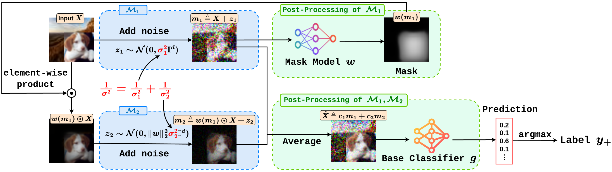

# Todo
- before moving to ARS repo, change all the import name; change corresponding url link in readme 
- update paper title in citation

<h2 align="center">
Adaptive Randomized Smoothing: Certified Adversarial Robustness for Multi-Step Defences (NeurIPS 2024 Spotlight)
</h2>

[Saiyue Lyu](https://saiyuelyu.github.io/)\*,
[Shadab Shaikh](https://shadabs.com/)\*,
[Frederick Shpilevskiy](https://systopia.cs.ubc.ca/people)\*,
[Evan Shelhamer](https://scholar.google.ca/citations?user=-ltRSM0AAAAJ&hl=en),
[Mathias Lécuyer](https://mathias.lecuyer.me/)


<h5 align="center">

[](https://arxiv.org/abs/2406.10427)
[](LICENSE)
[](https://nips.cc/virtual/2024/poster/95529)

</h5>

<p align="center">
  
</p>

## 📝 Some Important Notes
- `two_query_arch.py` is the core file of ars experiments, which corresponds to our the architecture illustrated in Figure 1 of our paper.
- In the yaml files, we are using &#9312; `arch.mask_type: "vanilla"` to refer to [Cohen et al.](https://github.com/locuslab/smoothing)'s training setup (without mask), &#9313; `arch.mask_type: "static"` refer to static mask training, and &#9314; `arch.mask_type: "adaptive"` refer to adaptive mask training (our main pipeline).
- For CIFAR-10 BG20K benchmark, we are using `data.transform.pad_size` in the yaml files to control how much padding we add to each side of the original 32x32x3 CIFAR-10 image. This `pad_size` argument directly translates to `k` denoted in the paper via the equation: `k = (32 + pad_size * 2)`. 

  For instance, for `k=48`, the `pad_size` is equal to 8. For any particular `k` that you wish to experiment with, you'll have to set the `pad_size` to `(k - 32) / 2` in the yaml file.

  For instance, if we set `pad_size` to 16, we get the final image of dimensions `(32 + 16 * 2) x (32 + 16 * 2) x 3`= `64 x 64 x 3` (i.e. `k = 64`).

  For CelebA, `data.transform.pad_size` means something different, it means how many pixels (in all directions) around a mouth (or eyes, or any other feature) must be within the randomly cropped image.
  
  For ImageNet, `data.transform.pad_size` is always set to 0.
- Explanations of most parameters can be found in the yaml files, check [CIFAR example yaml](src/configs/cifar_ars.yaml) and [CelebA example yaml](src/configs/celeba_ars.yaml).

## 🗻 Environment:
Required packages are listed in `env.txt`. You can install these packages with `pip install -r env.txt`.

## 🎒 Prepare Datasets:

### CIFAR-10

- You will need to download the original [CIFAR-10 dataset](https://www.cs.toronto.edu/~kriz/cifar.html)
- For our 20kBG benchmark, you will need to download the [BG-20k dataset](https://github.com/JizhiziLi/GFM?tab=readme-ov-file#bg-20k) (from [this](https://drive.google.com/drive/folders/1ZBaMJxZtUNHIuGj8D8v3B9Adn8dbHwSS) google drive folder).
- We split the BG-20k dataset into train and test set (according to the `train` and `testval` folders in the above google drive link). The train set contains roughly 15k samples and the test set 5k samples
- The background images are of varying dimensionality, hence we preprocess the image by `scripts/preprocess_bg20k/resize_bg20k_train.py` and `scripts/preprocess_bg20k/resize_bg20k_test.py` (sample commands listed in the files) to make the dimensionality uniform, according to a specific `k` you want to experiment with. We recommend doing such resizing during preprocessing step before training. Running this script will store resized train images in `<>/k_k_size/train` and resized test images in `<>/k_k_size/test`. You need to specify `data.transform.padded_img.path : <>/k_k_size` in the yaml files.
- We also compute data mean and standard deviation for different size versions of BG-20k via `scripts/preprocess_bg20k/compute_mean_std.py` (sample commands listed in the file). These values are used for normalization in the first layer of the base classifier. Check [line 36 in dataset.py](TODO update url) and [line 383 in dataset.py](TODO update url) to see how and why these numbers are used. We implemented it for options for `k = 32 (original size), 48, 64, 96`, but other values are also valid. For other values, you need to first preprocess (resize) and store the BG-20k data to the size you want (see previous point), and then calculate the mean and standard deviation, and finally do the simple corresponding modification in `dataset.py` (check line 70 in `dataset.py`).
- During dataloading, one randomly selected CIFAR-10 image overlays on one randomly selected resized BG-20k image, which together is one input image (both for training and testing/certification).

### CelebA
You will need to download the unaligned [CelebA dataset](https://mmlab.ie.cuhk.edu.hk/projects/CelebA.html) and enter the `celeba` folder path for `data.dataset_path` in the yaml. `celeba` folder will contain `img_celeba`, `identity_CelebA.txt`, `list_attr_celeba.txt`, etc. In particular, it contains the position of different features (e.g. mouth, eyes). As for classification task, we focus on label `mouth slightly open` by setting `data.multilabel_overwrite: 21` so that our model does binary classification on the 21st label. We apply a transformation to the data that moves the original CelebA images around while ensuring that `data.transform.face_feature` is kept within the transformed image. For our classification task, we want the area around the mouth to stay within the transformed image so we set `data.transform.face_feature: "mouth"` (`"eyes"` is also implemented).

- We notice the original dataset has centered faces, so we move the mouth around by randomly cropping images to 160 by 160 size , and guarantee that an area around mouth must be within the cropped image. From each corner of the face feature, a distance of at least `data.transform.pad_size` in every direction must be contained within the transformed image (so that the model may use this local information to identify the feature).

- CelebA images are multi-labeled for face features, we use `data.multilabel_overwrite` in the yaml to consider only the single selected label prediction.

### ImageNet
You will need to download the full [ImageNet dataset](https://www.image-net.org/download.php). The structure of ImageNet should be formulated as :
```
ImageNet
├── ILSVRC2012_train 
│   ├── index_synset.yaml
│   ├── filelist.txt
│   ├── imagenet1000_clsidx_to_labels.txt
│   ├── synset_human.txt
│   └── data
|       ├── n01440764
|       |   ├── n01440764_10382.JPEG
|       |   ├── n01440764_10150.JPEG
|       |   └── ...
│       ├── n01443537
|       |   └──  ...
|       └── ...
└── ILSVRC2012_validation 
    ├── index_synset.yaml
    ├── filelist.txt
    ├── validation_synset.txt
    ├── synset_human.txt
    ├── imagenet1000_clsidx_to_labels.txt
    └── data
        ├── n01440764
        |   ├── ILSVRC2012_val_00045866.JPEG
        |   ├── ILSVRC2012_val_00039905.JPEG
        |   └── ...
        ├── n01443537
        |   └──  ...
        └── ...
```

## 🚆 Train:

In `src/configs`, We provides 3 sample yamls for each of CIFAR-10, CelebA, and ImageNet. The main training file is `src/train.py`, with the command for CIFAR-10 and 3 different setups, &#9312; [Cohen et al.](https://github.com/locuslab/smoothing), 	&#9313; static mask, and 	&#9314; adaptive mask (ars), respectively:
```
python src/train.py --seed 1 --yaml src/configs/cifar_cohen.yaml
python src/train.py --seed 1 --yaml src/configs/cifar_static.yaml
python src/train.py --seed 1 --yaml src/configs/cifar_ars.yaml
```
where `--seed` (or `-s`) is the seed and `--yaml` (or `-y`) is the path to the respective config file. The config file will also be stored in the corresponding log folder for future references.

For ImageNet, we also consider a pretrained baseline, i.e. pretrain the base classifier of Cohen et al., then fix the classifier and only trains our mask model for few epochs. To achieve such goal, you should first pretrain the base classifier for Cohen et al. by `python src/train.py --seed 1 --yaml src/configs/imagenet_cohen.yaml` to get a model ckpt, then use the command :
```
python src/train.py --seed 1 --yaml src/configs/imagenet_ars.yaml --resume_mask_only <path to the pretrained model ckpt>
```
where `--resume_mask_only` (or `-r`) is the resume training flag whose default value is `None`, when specified with a path to a pretrained model ckpt, the training is only resumed on the mask model.

When you finish training, a sample log folder will be generated as :
```
logs
├── 2024-05-15T00-00-01_cifar_sig05_pad8_ars
│   ├── 2024-05-15T00-00-01-config.yaml
│   ├── model_sd.pt
│   ├── train_log.txt
│   ├── train_loss.txt
│   ├── train
│   |   ├── ...
|   |   └── ...
│   └── test
|       ├── epoch_10
│       |   ├── pipeline.png
│       |   ├── origial_images.pt
│       |   ├── q_1_images.pt
│       |   ├── post_clamped_second_query_masks.pt
│       |   ├── q_2_images_before_averaging.pt
│       |   └── q_2_images_after_averaging.pt
│       ├── epoch_20
│       └── ...
```
You can save `pipeline.png` by specifying `visualize.save_intermediate_fig: True` in the yaml, and you will get a plot like [this example](assets/sample_cifar_pipeline.png) or Figure 12,13,14,15 in the paper appendix to visualize the mask learning. You can save those `.pt` images by specifying `save_intermediate_imgs: True` in the yaml, these intermediate images will be useful if you want to plot the pipeline figure after the training is finished. See Plotting section below. You can also turn off these visualize flags to speed up training a bit, but after training is finished, you can not get those intermediate values thus can not visualize the masks.

### Multi GPU Training for ImageNet

We provide multi-gpu training scipts for ars ImageNet settings on a SLURM enabled cluster, via Distributed Data Parallel ([ddp](https://pytorch.org/tutorials/intermediate/ddp_tutorial.html)). Our modifications are based on [Pytorch example](https://github.com/pytorch/examples/blob/main/imagenet/main.py) and [Compute Canda example](https://docs.alliancecan.ca/wiki/PyTorch#Data_parallelism_with_multiple_GPUs). You can do multi-gpu training for ImageNet by [this shell script](ddp/ddp.sh) or the following commands :
```
export MASTER_ADDR=$(hostname)
srun python ddp/train_ddp.py -s 1 -y src/configs/imagenet_ars.yaml --init_method tcp://$MASTER_ADDR:3456 --world_size $((SLURM_NTASKS_PER_NODE * SLURM_JOB_NUM_NODES)) 
```

## 💯 Certify:

The main certifying file is `src/certify.py`, with the commmand:
```
python src/certify.py -s 1 -y src/configs/cifar_ars.yaml --log_dir <logs/...>
```
where `-s 1` specifies the seed, `-y src/.../...yaml` specifies the config file used for training (and contains certification parameters), and `--log_dir logs/...` specifies the path of the logs for the completed training process. Certification relevant parameters are listed in `certify` section in the yaml. You can check [this example](assets/sample_certification_log_cifar_sig05_pad16_ars.txt) for a sample certifiation log. Then you can use such log file to make plots as discussed below.

## 📈 Plotting:

### To make pipline plots:
In addition to check the training accuracy in `train_log.txt` in the logs, these pipeline plots are helpful to visualize the mask learning, you can see whether the training process is going well by checking whether the masks learned make sense. When the training is done, if you want to make pipeline plots like [this example](assets/sample_cifar_pipeline.png), first you need to make sure you save intermediate images by specifying `save_intermediate_imgs: True` in the yaml during training. Then you can run any of the following two commands (just two slightly different versions of the pipeline figure) :
```
python scripts/plot/pipeline.py --total_sigma 0.5 --indices deterministic --log_dir <logs/...>
python scripts/plot/pipeline_v2.py --k 64 --total_sigma 0.5 --indices deterministic --log_dir <logs/...>
```

### To make line plots of certified accuracy:
To visualize the certified accuracy (after certification finishes and generate a certification log) for single run, you can use the following command to produce such a [plot](assets/sample_1seed_plot.png):
```
python scripts/plot/certified_acc_1seed.py --logpath <logs/XXXX/certification_log_50000.txt> --outdir <path you want to save the plot>
```
If you want to produce plots like Figure 2 in the paper, i.e. with ARS, static, and Cohen et al., each with 3 seeds run. You will need to move the 3 seed logs to one folder (and rename them to seed[i].txt) as structured below and use the command :
```
ars
├── seed1.txt
├── seed2.txt
└── seed3.txt
python3 scripts/plot/certified_acc_3seed.py --outdir . --ars <ars path> --static <static path> --cohen <cohen path>
```

## 🤝 Citation
If you find our work useful to your research, please cite:
```
@article{lyu2024adaptive,
  title={Adaptive Randomized Smoothing: Certified Adversarial Robustness for Multi-Step Defences},
  author={Lyu *, Saiyue and Shaikh *, Shadab and Shpilevskiy *, Frederick and Shelhamer, Evan and Lécuyer, Mathias},
  pdf={https://arxiv.org/abs/2406.10427},
  journal={Advances in Neural Information Processing Systems},
  year={2024},
}
```

